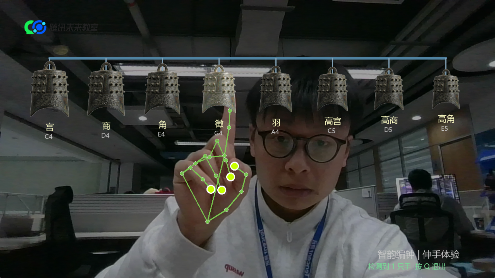

# 🔔 智韵编钟 · 体感演奏器

> 用手掌在摄像头前"敲击"虚拟编钟，触发真实的古风音调。MediaPipe 手势识别 + 实时音效 + 真实编钟图像。

   

---

## 🎬 效果预览



> 腾讯未来教室场景实拍 — 手势识别追踪（绿色骨骼线）+ 虚拟编钟实时交互

---

## ✨ 功能特色

- 📷 摄像头实时捕捉手部动作，支持**双手同时演奏**
- 🔔 使用真实编钟图片资源，8个钟顶部横排显示，按音调有大小差异
- 🎵 触碰编钟时钟体**变亮发光**，同步触发对应音调
- 🖼️ 左上角腾讯未来教室 Logo 展示，右下角中文提示（PIL 渲染，无乱码）
- 📦 提供打包好的 `bianchong.exe`，**双击即用，无需安装 Python**

---

## 🎵 音阶对照

| 钟序 | 音名 | 频率 | 中文音名 |
|------|------|------|--------|
| 1 | C4 | 261.63 Hz | 宫 |
| 2 | D4 | 293.66 Hz | 商 |
| 3 | E4 | 329.63 Hz | 角 |
| 4 | G4 | 392.00 Hz | 徵 |
| 5 | A4 | 440.00 Hz | 羽 |
| 6 | C5 | 523.25 Hz | 高宫 |
| 7 | D5 | 587.33 Hz | 高商 |
| 8 | E5 | 659.25 Hz | 高角 |

---

## 🚀 快速开始

### 方式一：直接运行（推荐 Windows）

双击 `启动编钟.bat` 或直接运行 `bianchong.exe`，无需安装任何依赖。

> ⚠️ 首次启动可能被 Windows 安全提示拦截，点击"仍要运行"即可。

### 方式二：Python 源码运行

**环境要求：** Python 3.9 ~ 3.13（不支持 3.14）、摄像头

```bash
git clone https://github.com/leonmangsos/bianchong.git
cd bianchong
pip install -r requirements.txt
python bianchong.py
```

按 **Q** 或 **ESC** 退出。

---

## 📁 项目结构

```
bianchong/
├── bianchong.py          # 主程序
├── process_bg.py         # 背景处理工具
├── bianchong.spec        # PyInstaller 打包配置
├── requirements.txt      # Python 依赖
├── 启动编钟.bat           # Windows 一键启动脚本
├── bell_transparent.png  # 编钟图片素材（透明背景）
├── logo.png              # Logo 图片
├── preview.png           # 效果截图
└── README.md
```

---

## 🛠 技术栈

| 模块 | 用途 |
|------|------|
| `mediapipe` | 手部 21 关键点实时识别 |
| `opencv-python` | 摄像头采集 + 画面渲染 |
| `pygame.mixer` | 实时音频预加载 + 播放 |
| `Pillow` | 中文文字渲染（无乱码） |
| `numpy` | 合成钟声波形（基频+泛音+衰减） |

---

## 🎮 操作说明

- **伸出手掌**：MediaPipe 自动检测，绿色骨骼线显示
- **触碰编钟**：指尖进入钟体范围触发音效（0.35s 冷却防抖）
- **双手演奏**：同时支持 2 只手，可和弦
- **退出**：按 `Q` 或 `ESC`

---

## 💡 扩展思路

- [ ] 加入录制功能，保存演奏片段
- [ ] 支持自定义音阶（古琴调、编磬调）
- [ ] 添加跟谱练习模式
- [ ] 接入更多打击乐器（磬、鼓、木鱼）

---

Made with ❤️ by leonmangsos × OpenClaw AI